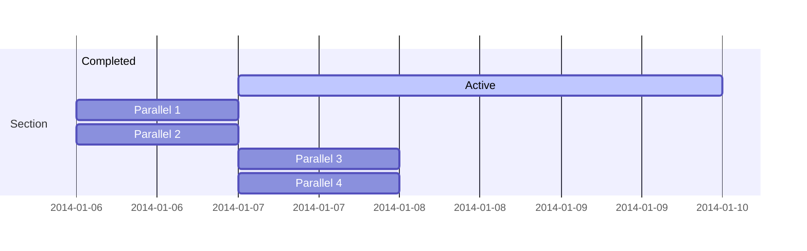

## Problem

## Solution


This is the description. Testing [links](https://docs.google.com/document/d/1Mx04YMMvGGacIVRiFUY_4pr98eu_u4Zf/edit#heading=h.1fob9te)

## Overview

1. The Hugo Blox website builder for Hugo, along with its starter templates, is designed for professional creators, educators, and teams/organizations - although it can be used to create any kind of site
2. The template can be modified and customised to suit your needs. It's a good platform for anyone looking to take control of their data and online identity whilst having the convenience to start off with a **no-code solution (write in Markdown and customize with YAML parameters)** and having **flexibility to later add even deeper personalization with HTML and CSS**
3. You can work with all your favourite tools and apps with hundreds of plugins and integrations to speed up your workflows, interact with your readers, and much more

## Features

- **Page builder** - Create _anything_ with no-code [**blocks**](https://hugoblox.com/blocks/) and [**elements**](https://docs.hugoblox.com/reference/markdown/)
- **Edit any type of content** - Blog posts, publications, talks, slides, projects, and more!
- **Create content** in [**Markdown**](https://docs.hugoblox.com/reference/markdown/), [**Jupyter**](https://docs.hugoblox.com/getting-started/cms/), or [**RStudio**](https://docs.hugoblox.com/getting-started/cms/)
- **Plugin System** - Fully customizable [**color** and **font themes**](https://docs.hugoblox.com/getting-started/customize/)
- **Display Code and Math** - Code syntax highlighting and LaTeX math supported
- **Integrations** - [Google Analytics](https://analytics.google.com), [Disqus commenting](https://disqus.com), Maps, Contact Forms, and more!
- **Beautiful Site** - Simple and refreshing one-page design
- **Industry-Leading SEO** - Help get your website found on search engines and social media
- **Media Galleries** - Display your images and videos with captions in a customizable gallery
- **Mobile Friendly** - Look amazing on every screen with a mobile friendly version of your site
- **Multi-language** - 35+ language packs including English, 中文, and Português
- **Multi-user** - Each author gets their own profile page
- **Privacy Pack** - Assists with GDPR
- **Stand Out** - Bring your site to life with animation, parallax backgrounds, and scroll effects
- **One-Click Deployment** - No servers. No databases. Only files.

# From conference page index

{}
Click the _Cite_ button above to demo the feature to enable visitors to import publication metadata into their reference management software.
{}

{}
Create your slides in Markdown - click the _Slides_ button to check out the example.
{}

Add the publication's **full text** or **supplementary notes** here. You can use rich formatting such as including [code, math, and images](https://docs.hugoblox.com/content/writing-markdown-latex/).

# From G&O article page

{}
Click the *Cite* button above to demo the feature to enable visitors to import publication metadata into their reference management software.
{}

{}
Create your slides in Markdown - click the *Slides* button to check out the example.
{}

Add the publication's **full text** or **supplementary notes** here. You can use rich formatting such as including [code, math, and images](https://docs.hugoblox.com/content/writing-markdown-latex/).

# moved entire block from one page

- block: collection
id: talks
content:
  title: Recent & Upcoming Talks
  filters:
    folders:
      - event
design:
  view: article-grid
  columns: 1

  # moved entire block from main index?

  - block: collection
  content:
    title: Recent Publications
    text: ""
    filters:
      folders:
        - publication
      exclude_featured: false
  design:
    view: citation

    # removed topnav links
     - name: Talks
    url: /#talks
    weight: 12

    # removed from bottom of content>index
    - block: cta-card
    demo: true # Only display this section in the Hugo Blox Builder demo site
    content:
      title: 👉 Build your own academic website like this
      text: |-
        This site is generated by Hugo Blox Builder - the FREE, Hugo-based open source website builder trusted by 250,000+ academics like you.

        <a class="github-button" href="https://github.com/HugoBlox/hugo-blox-builder" data-color-scheme="no-preference: light; light: light; dark: dark;" data-icon="octicon-star" data-size="large" data-show-count="true" aria-label="Star HugoBlox/hugo-blox-builder on GitHub">Star</a>

        Easily build anything with blocks - no-code required!
        
        From landing pages, second brains, and courses to academic resumés, conferences, and tech blogs.
      button:
        text: Get Started
        url: https://hugoblox.com/templates/
    design:
      card:
        # Card background color (CSS class)
        css_class: "bg-primary-700"
        css_style: ""

# This is a big feature-laden section that I deleted out of my earnings call event news post

Welcome 👋



## Overview

1. The Hugo Blox website builder for Hugo, along with its starter templates, is designed for professional creators, educators, and teams/organizations - although it can be used to create any kind of site
2. The template can be modified and customised to suit your needs. It's a good platform for anyone looking to take control of their data and online identity whilst having the convenience to start off with a **no-code solution (write in Markdown and customize with YAML parameters)** and having **flexibility to later add even deeper personalization with HTML and CSS**
3. You can work with all your favourite tools and apps with hundreds of plugins and integrations to speed up your workflows, interact with your readers, and much more

[//]: # ([![The template is mobile first with a responsive design to ensure that your site looks stunning on every device.]&#40;https://raw.githubusercontent.com/wowchemy/wowchemy-hugo-modules/main/starters/academic/preview.png&#41;]&#40;https://hugoblox.com&#41;)

### Get Started

- 👉 [**Create a new site**](https://hugoblox.com/templates/)
- 📚 [**Personalize your site**](https://docs.hugoblox.com/)
- 💬 [Chat with the **Hugo Blox community**](https://discord.gg/z8wNYzb) or [**Hugo community**](https://discourse.gohugo.io)
- 🐦 Twitter: [@GetResearchDev](https://twitter.com/GetResearchDev) [@GeorgeCushen](https://twitter.com/GeorgeCushen) #MadeWithHugoBlox
- 💡 [Request a **feature** or report a **bug** for _Hugo Blox_](https://github.com/HugoBlox/hugo-blox-builder/issues)
- ⬆️ **Updating Hugo Blox?** View the [Update Guide](https://docs.hugoblox.com/reference/update/) and [Release Notes](https://github.com/HugoBlox/hugo-blox-builder/releases)

## Crowd-funded open-source software

To help us develop this template and software sustainably under the MIT license, we ask all individuals and businesses that use it to help support its ongoing maintenance and development via sponsorship.

### [❤️ Click here to become a sponsor and help support Hugo Blox's future ❤️](https://hugoblox.com/sponsor/)

As a token of appreciation for sponsoring, you can **unlock [these](https://hugoblox.com/sponsor/) awesome rewards and extra features 🦄✨**

## Ecosystem

- **[Bibtex To Markdown](https://github.com/GetRD/academic-file-converter):** Automatically import publications from BibTeX

## Inspiration

[Learn what other **creators**](https://hugoblox.com/creators/) are building with this template.

## Features

- **Page builder** - Create _anything_ with no-code [**blocks**](https://hugoblox.com/blocks/) and [**elements**](https://docs.hugoblox.com/reference/markdown/)
- **Edit any type of content** - Blog posts, publications, talks, slides, projects, and more!
- **Create content** in [**Markdown**](https://docs.hugoblox.com/reference/markdown/), [**Jupyter**](https://docs.hugoblox.com/getting-started/cms/), or [**RStudio**](https://docs.hugoblox.com/getting-started/cms/)
- **Plugin System** - Fully customizable [**color** and **font themes**](https://docs.hugoblox.com/getting-started/customize/)
- **Display Code and Math** - Code syntax highlighting and LaTeX math supported
- **Integrations** - [Google Analytics](https://analytics.google.com), [Disqus commenting](https://disqus.com), Maps, Contact Forms, and more!
- **Beautiful Site** - Simple and refreshing one-page design
- **Industry-Leading SEO** - Help get your website found on search engines and social media
- **Media Galleries** - Display your images and videos with captions in a customizable gallery
- **Mobile Friendly** - Look amazing on every screen with a mobile friendly version of your site
- **Multi-language** - 35+ language packs including English, 中文, and Português
- **Multi-user** - Each author gets their own profile page
- **Privacy Pack** - Assists with GDPR
- **Stand Out** - Bring your site to life with animation, parallax backgrounds, and scroll effects
- **One-Click Deployment** - No servers. No databases. Only files.

## Themes

Hugo Blox and its templates come with **automatic day (light) and night (dark) mode** built-in. Visitors can choose their preferred mode by clicking the sun/moon icon in the header.

[Choose a stunning **theme** and **font**](https://docs.hugoblox.com/getting-started/customize/) for your site. Themes are fully customizable.

## License

Copyright 2016-present [George Cushen](https://georgecushen.com).

Released under the [MIT](https://github.com/HugoBlox/hugo-blox-builder/blob/main/LICENSE.md) license.

# Taken from another news article
## Mindmaps

Hugo Blox supports a Markdown extension for mindmaps.

With this open format, can even edit your mindmaps in other popular tools such as Obsidian.

Simply insert a Markdown code block labelled as `markmap` and optionally set the height of the mindmap as shown in the example below.

Mindmaps can be created by simply writing the items as a Markdown list within the `markmap` code block, indenting each item to create as many sub-levels as you need:

<div class="highlight">
<pre class="chroma">
<code>
```markmap {height="200px"}
- Hugo Modules
  - Hugo Blox
  - blox-plugins-netlify
  - blox-plugins-netlify-cms
  - blox-plugins-reveal
```
</code>
</pre>
</div>

renders as

```markmap {height="200px"}
- Hugo Modules
  - Hugo Blox
  - blox-plugins-netlify
  - blox-plugins-netlify-cms
  - blox-plugins-reveal
```

Anh here's a more advanced mindmap with formatting, code blocks, and math:

<div class="highlight">
<pre class="chroma">
<code>
```markmap
- Mindmaps
  - Links
    - [Hugo Blox Docs](https://docs.hugoblox.com/)
    - [Discord Community](https://discord.gg/z8wNYzb)
    - [GitHub](https://github.com/HugoBlox/hugo-blox-builder)
  - Features
    - Markdown formatting
    - **inline** ~~text~~ *styles*
    - multiline
      text
    - `inline code`
    -
      ```js
      console.log('hello');
      console.log('code block');
      ```
    - Math: $x = {-b \pm \sqrt{b^2-4ac} \over 2a}$
```
</code>
</pre>
</div>

renders as

```markmap
- Mindmaps
  - Links
    - [Hugo Blox Docs](https://docs.hugoblox.com/)
    - [Discord Community](https://discord.gg/z8wNYzb)
    - [GitHub](https://github.com/HugoBlox/hugo-blox-builder)
  - Features
    - Markdown formatting
    - **inline** ~~text~~ *styles*
    - multiline
      text
    - `inline code`
    -
      ```js
      console.log('hello');
      console.log('code block');
      ```
    - Math: $x = {-b \pm \sqrt{b^2-4ac} \over 2a}$
```

## Highlighting

<mark>Highlight</mark> important text with `mark`:

```html
<mark>Highlighted text</mark>
```

## Callouts

Use [callouts](https://docs.hugoblox.com/reference/markdown/#callouts) (aka _asides_, _hints_, or _alerts_) to draw attention to notes, tips, and warnings.

By wrapping a paragraph in `{} ... {}`, it will render as an aside.

```markdown
{}
A Markdown aside is useful for displaying notices, hints, or definitions to your readers.
{}
```

renders as

{}
A Markdown aside is useful for displaying notices, hints, or definitions to your readers.
{}

Or use the `warning` callout type so your readers don't miss critical details:

{}
A Markdown aside is useful for displaying notices, hints, or definitions to your readers.
{}

## Did you find this page helpful? Consider sharing it 🙌

# taken out of MA education section
 Thesis on _Why LLMs are awesome_. Supervised by [Prof Joe Smith](https://example.com). Presented papers at 5 IEEE conferences with the contributions being published in 2 Springer journals.
    button:
      text: 'Read Thesis'
      url: 'https://example.com'


[Hugo Blox Builder](https://hugoblox.com) is designed to give technical content creators a seamless experience. You can focus on the content and the Hugo Blox Builder which this template is built upon handles the rest.

**Embed videos, podcasts, code, LaTeX math, and even test students!**

On this page, you'll find some examples of the types of technical content that can be rendered with Hugo Blox.

## Video

Teach your course by sharing videos with your students. Choose from one of the following approaches:



**Youtube**:

    

**Bilibili**:

    

**Video file**

Videos may be added to a page by either placing them in your `assets/media/` media library or in your [page's folder](https://gohugo.io/content-management/page-bundles/), and then embedding them with the _video_ shortcode:

    

## Podcast

You can add a podcast or music to a page by placing the MP3 file in the page's folder or the media library folder and then embedding the audio on your page with the _audio_ shortcode:

    

Try it out:



## Test students

Provide a simple yet fun self-assessment by revealing the solutions to challenges with the `spoiler` shortcode:

```markdown

You found me!

```

renders as

 You found me 🎉 

## Math

Hugo Blox Builder supports a Markdown extension for $\LaTeX$ math. You can enable this feature by toggling the `math` option in your `config/_default/params.yaml` file.

To render _inline_ or _block_ math, wrap your LaTeX math with `$...$` or `$$...$$`, respectively.

{}
We wrap the LaTeX math in the Hugo Blox _math_ shortcode to prevent Hugo rendering our math as Markdown.
{}

Example **math block**:

```latex

$$
\gamma_{n} = \frac{ \left | \left (\mathbf x_{n} - \mathbf x_{n-1} \right )^T \left [\nabla F (\mathbf x_{n}) - \nabla F (\mathbf x_{n-1}) \right ] \right |}{\left \|\nabla F(\mathbf{x}_{n}) - \nabla F(\mathbf{x}_{n-1}) \right \|^2}
$$

```

renders as


$$\gamma_{n} = \frac{ \left | \left (\mathbf x_{n} - \mathbf x_{n-1} \right )^T \left [\nabla F (\mathbf x_{n}) - \nabla F (\mathbf x_{n-1}) \right ] \right |}{\left \|\nabla F(\mathbf{x}_{n}) - \nabla F(\mathbf{x}_{n-1}) \right \|^2}$$


Example **inline math** `$\nabla F(\mathbf{x}_{n})$` renders as $\nabla F(\mathbf{x}_{n})$.

Example **multi-line math** using the math linebreak (`\\`):

```latex

$$f(k;p_{0}^{*}) = \begin{cases}p_{0}^{*} & \text{if }k=1, \\
1-p_{0}^{*} & \text{if }k=0.\end{cases}$$

```

renders as



$$
f(k;p_{0}^{*}) = \begin{cases}p_{0}^{*} & \text{if }k=1, \\
1-p_{0}^{*} & \text{if }k=0.\end{cases}
$$



## Code

Hugo Blox Builder utilises Hugo's Markdown extension for highlighting code syntax. The code theme can be selected in the `config/_default/params.yaml` file.


    ```python
    import pandas as pd
    data = pd.read_csv("data.csv")
    data.head()
    ```

renders as

```python
import pandas as pd
data = pd.read_csv("data.csv")
data.head()
```

## Inline Images

```go
 Python
```

renders as

 Python

## Did you find this page helpful? Consider sharing it 🙌


Easily manage your projects - create ideation mind maps, Gantt charts, todo lists, and more!

## Ideation

Hugo Blox supports a Markdown extension for mindmaps.

Simply insert a Markdown code block labelled as `markmap` and optionally set the height of the mindmap as shown in the example below.

Mindmaps can be created by simply writing the items as a Markdown list within the `markmap` code block, indenting each item to create as many sub-levels as you need:

<div class="highlight">
<pre class="chroma">
<code>
```markmap {height="200px"}
- Hugo Modules
  - Hugo Blox
  - blox-plugins-netlify
  - blox-plugins-netlify-cms
  - blox-plugins-reveal
```
</code>
</pre>
</div>

renders as

```markmap {height="200px"}
- Hugo Modules
  - Hugo Blox
  - blox-plugins-netlify
  - blox-plugins-netlify-cms
  - blox-plugins-reveal
```

## Diagrams

Hugo Blox supports the _Mermaid_ Markdown extension for diagrams.

An example **Gantt diagram**:

    ```mermaid
    gantt
    section Section
    Completed :done,    des1, 2014-01-06,2014-01-08
    Active        :active,  des2, 2014-01-07, 3d
    Parallel 1   :         des3, after des1, 1d
    Parallel 2   :         des4, after des1, 1d
    Parallel 3   :         des5, after des3, 1d
    Parallel 4   :         des6, after des4, 1d
    ```

renders as



## Todo lists

You can even write your todo lists in Markdown too:

```markdown
- [x] Write math example
  - [x] Write diagram example
- [ ] Do something else
```

renders as

- [x] Write math example
  - [x] Write diagram example
- [ ] Do something else

## Did you find this page helpful? Consider sharing it 🙌
<!--more-->
