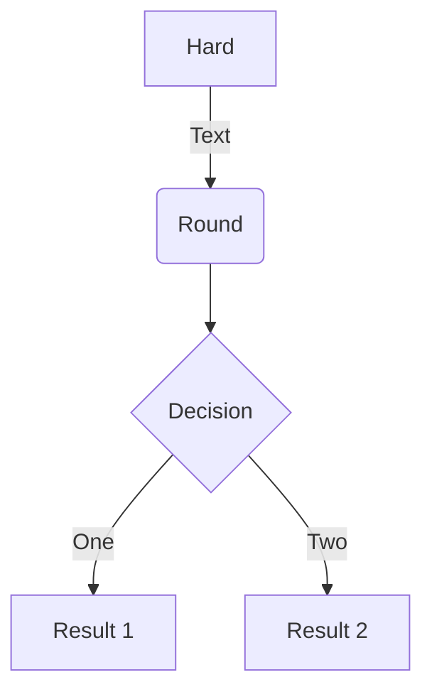
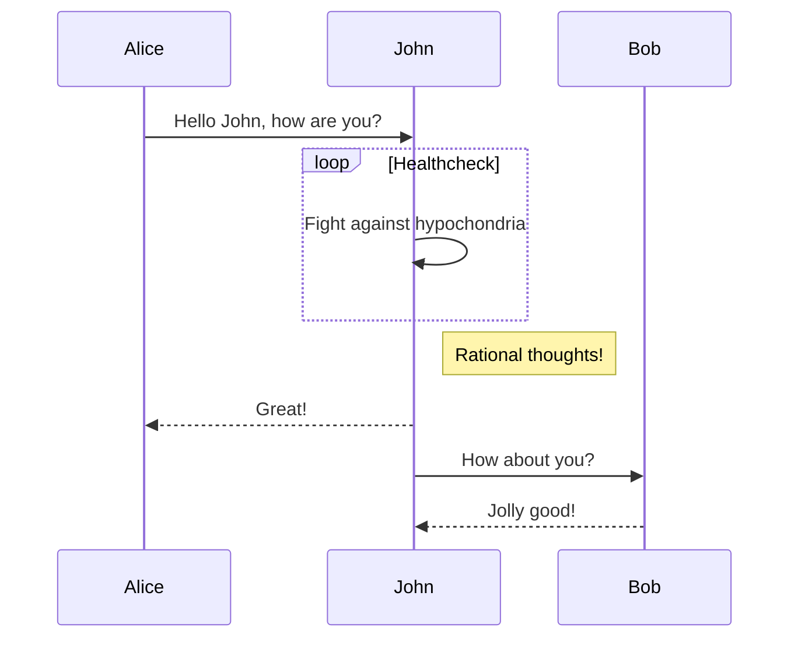
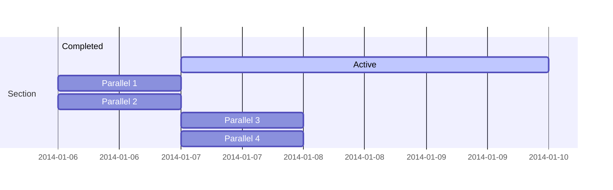
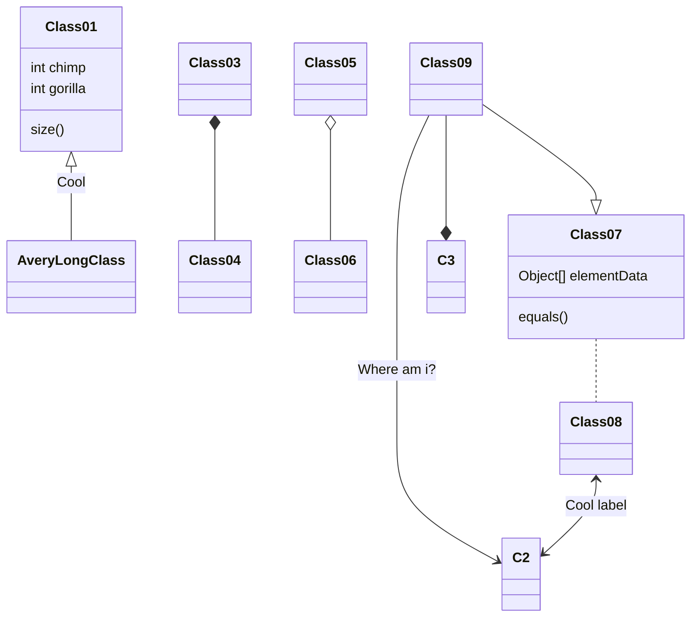
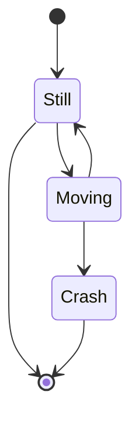

When it comes to methods or tools, writers and editors have plenty of options to choose from. Nearly everyone has used a WYSIWYG editor, such as Word or Google Docs, to quickly and easily create and format digital content. Similarly, most Technical Writers are familiar with the XML and DITA formats used in software such as MadCap Flare, and most web developers can use HTML and CSS to create or edit web pages. If you aren't a web developer but you still want to create and customize your own website without having to learn a complex programming language, perhaps Markdown is a good choice for you. This entire website was created using the Academic, an open-source Hugo theme template available from Wowchemy. Hugo Academic and Wowchemy both use Markdown, a plain text formatting syntax that converts easy-to-read source material into web-ready HTML. Markdown provides a straightforward and consistent way to format text. And with Markdown extensions and integrations, you can format more complex and specialized content. On this page, you'll find some examples of the types of technical content that can be rendered with Markdown extensions when you create a website using Hugo Academic.

## Examples

### Code

There are Markdown extension for highlighting **code syntax**. In Markdown: 

    ```python
    import pandas as pd
    data = pd.read_csv("data.csv")
    data.head()
    ```

renders as

```python
import pandas as pd
data = pd.read_csv("data.csv")
data.head()
```

### Mindmaps

There's a Markdown extension for mindmaps. A **simple mindmap** defined as a Markdown list:

<div class="highlight">
<pre class="chroma">
<code>
```markmap {height="200px"}
- Hugo Modules
  - wowchemy
  - wowchemy-plugins-netlify
  - wowchemy-plugins-netlify-cms
  - wowchemy-plugins-reveal
```
</code>
</pre>
</div>

renders as

```markmap {height="200px"}
- Hugo Modules
  - wowchemy
  - wowchemy-plugins-netlify
  - wowchemy-plugins-netlify-cms
  - wowchemy-plugins-reveal
```

A more **advanced mindmap** with formatting, code blocks, and math:

<div class="highlight">
<pre class="chroma">
<code>
```markmap
- Mindmaps
  - Links
    - [Wowchemy Docs](https://wowchemy.com/docs/)
    - [Discord Community](https://discord.gg/z8wNYzb)
    - [GitHub](https://github.com/wowchemy/wowchemy-hugo-themes)
  - Features
    - Markdown formatting
    - **inline** ~~text~~ *styles*
    - multiline
      text
    - `inline code`
    -
      ```js
      console.log('hello');
      console.log('code block');
      ```
    - Math: $x = {-b \pm \sqrt{b^2-4ac} \over 2a}$
```
</code>
</pre>
</div>

renders as

```markmap
- Mindmaps
  - Links
    - [Wowchemy Docs](https://wowchemy.com/docs/)
    - [Discord Community](https://discord.gg/z8wNYzb)
    - [GitHub](https://github.com/wowchemy/wowchemy-hugo-themes)
  - Features
    - Markdown formatting
    - **inline** ~~text~~ *styles*
    - multiline
      text
    - `inline code`
    -
      ```js
      console.log('hello');
      console.log('code block');
      ```
    - Math: $x = {-b \pm \sqrt{b^2-4ac} \over 2a}$
```

### Math

There's even a Markdown extension for $\LaTeX$ math. This **math** block:

```latex

$$
\gamma_{n} = \frac{ \left | \left (\mathbf x_{n} - \mathbf x_{n-1} \right )^T \left [\nabla F (\mathbf x_{n}) - \nabla F (\mathbf x_{n-1}) \right ] \right |}{\left \|\nabla F(\mathbf{x}_{n}) - \nabla F(\mathbf{x}_{n-1}) \right \|^2}
$$

```

renders as


$$\gamma_{n} = \frac{ \left | \left (\mathbf x_{n} - \mathbf x_{n-1} \right )^T \left [\nabla F (\mathbf x_{n}) - \nabla F (\mathbf x_{n-1}) \right ] \right |}{\left \|\nabla F(\mathbf{x}_{n}) - \nabla F(\mathbf{x}_{n-1}) \right \|^2}$$


You can also create **inline math**. For instance, `$\nabla F(\mathbf{x}_{n})$` renders as $\nabla F(\mathbf{x}_{n})$.

And writing **multi-line math** is just as easy using the math linebreak (`\\`):

```latex

$$f(k;p_{0}^{*}) = \begin{cases}p_{0}^{*} & \text{if }k=1, \\
1-p_{0}^{*} & \text{if }k=0.\end{cases}$$

```

renders as



$$
f(k;p_{0}^{*}) = \begin{cases}p_{0}^{*} & \text{if }k=1, \\
1-p_{0}^{*} & \text{if }k=0.\end{cases}
$$



### Diagrams

There are Markdown extension for diagrams. This Markdown **flowchart** block: 

    ```mermaid
    graph TD
    A[Hard] -->|Text| B(Round)
    B --> C{Decision}
    C -->|One| D[Result 1]
    C -->|Two| E[Result 2]
    ```

renders as



And this **sequence diagram** block:

    ```mermaid
    sequenceDiagram
    Alice->>John: Hello John, how are you?
    loop Healthcheck
        John->>John: Fight against hypochondria
    end
    Note right of John: Rational thoughts!
    John-->>Alice: Great!
    John->>Bob: How about you?
    Bob-->>John: Jolly good!
    ```

renders as



The following **Gantt diagram** block:

    ```mermaid
    gantt
    section Section
    Completed :done,    des1, 2014-01-06,2014-01-08
    Active        :active,  des2, 2014-01-07, 3d
    Parallel 1   :         des3, after des1, 1d
    Parallel 2   :         des4, after des1, 1d
    Parallel 3   :         des5, after des3, 1d
    Parallel 4   :         des6, after des4, 1d
    ```

renders as



This **class diagram** block:

    ```mermaid
    classDiagram
    Class01 <|-- AveryLongClass : Cool
    Class03 *-- Class04
    Class05 o-- Class06
    Class07 .. Class08
    Class09 --> C2 : Where am i?
    Class09 --* C3
    Class09 --|> Class07
    Class07 : equals()
    Class07 : Object[] elementData
    Class01 : size()
    Class01 : int chimp
    Class01 : int gorilla
    Class08 <--> C2: Cool label
    ```

renders as



And this **state diagram** block:

    ```mermaid
    stateDiagram
    [*] --> Still
    Still --> [*]
    Still --> Moving
    Moving --> Still
    Moving --> Crash
    Crash --> [*]
    ```

renders as



### Todo lists

With all these Markdown extensions to choose from, you'll likely need to create a **to-do list**. This Markdown block:

```markdown
- [x] Write math example
  - [x] Write diagram example
- [ ] Do something else
```

renders as

- [x] Write math example
  - [x] Write diagram example
- [ ] Do something else

### Tables

You can also convert a spreadsheet into a Markdown table. Simply **render a CSV file** stored in your project files by adding the _Table_ shortcode to your page:

```go

```

renders as



### Callouts

Hugo Academic supports a [shortcode for callouts](https://wowchemy.com/docs/content/writing-markdown-latex/#callouts), also referred to as _asides_, _hints_, or _alerts_. The **aside** block below: 

```markdown
{}
A Markdown aside is useful for displaying notices, hints, or definitions to your readers.
{}
```

renders as

{}
A Markdown aside is useful for displaying notices, hints, or definitions to your readers.
{}

### Spoilers

You can also add a spoiler to a page to reveal text, such as an answer to a question, after a button is clicked. The **spoiler** block below:

```markdown

You found me!

```

renders as

 You found me! 

### Icons

Hugo Academic also enables you to use a wide range of [icons from _Font Awesome_ and _Academicons_](https://wowchemy.com/docs/getting-started/page-builder/#icons) in addition to [emojis](https://wowchemy.com/docs/content/writing-markdown-latex/#emojis).

The following **icon** shortcodes:

```markdown
 Terminal  
 Python  
 R
```

renders as

 Terminal  
 Python  
 R

### Did you find this page helpful? Consider sharing it 🙌
