## Overview  
As part of a major redesign of the eFax web app, I led the creation and deployment of a new set of user-facing help experiences using Whatfix — replacing traditional FAQs and help articles with context-sensitive microcontent. I coordinated content planning, team writing, peer reviews, implementation, and analytics tracking to deliver a successful, high-impact launch.

## 🧩 The Problem  
With a redesigned flagship app on the way, Consensus Cloud Solutions decided to replace its outdated documentation system with **Whatfix**, a digital adoption platform. This required:

- Writing all new help content in a microcontent format  
- Training traditional tech writers to author short-form content (popups, walk-throughs, tooltips)  
- Creating **display rules** to control where and when help appears  
- Leveraging Whatfix analytics to **measure user engagement and impact**  

As the Whatfix Lead, I was responsible for the entire content rollout and for responding to ongoing content needs from Product leadership.

## 💡 My Solution  
I managed the end-to-end microcontent implementation, including:

- **Content Planning**: Created a list of content pieces based on app structure and stakeholder requirements  
- **Team Enablement**: Shared microcontent writing guidelines, assigned writing tasks, and ran peer reviews  
- **Implementation**: Built display logic for popups, smart tips, beacons, and articles using Whatfix tools  
- **Analytics**: Set up detailed usage reports and spreadsheets to track user interaction and content performance  
- **Collaboration**: Fulfilled ad-hoc requests from Product for targeted content updates outside the normal dev cycle  

### ✍️ Writing Guidelines (Applied Across All Content)

- Keep writing concise (assume UI elements are partially self-explanatory)  
- Avoid screenshots, tables, or nested lists (due to space constraints)  
- Don't reference other content pieces or topics. Instead, write each content piece to stand alone.  

---

## 🧪 Representative Content

### 📢 Popups  
Targeted prompts on first, second, and third login and at key pain points. Some include links to guided walk-throughs.  
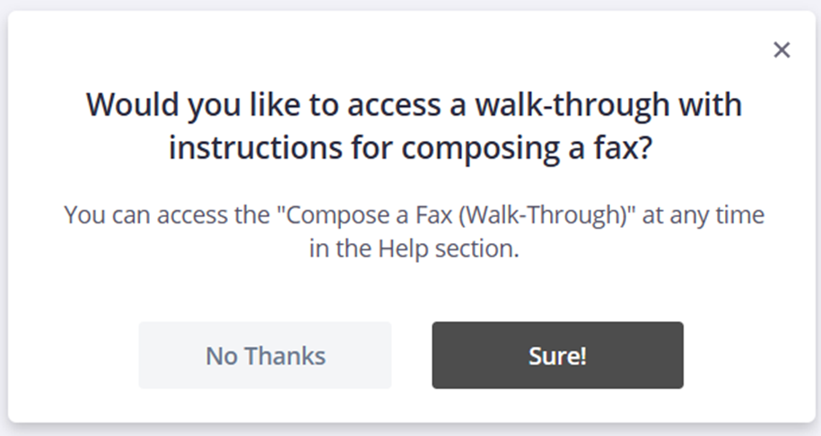  
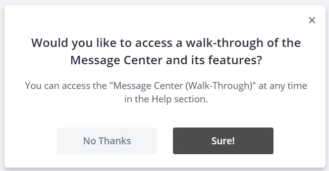  
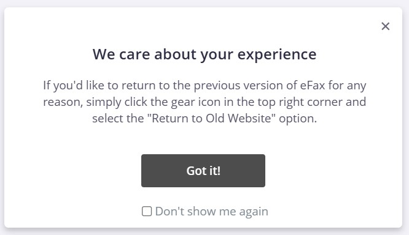  
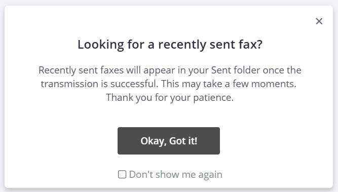  
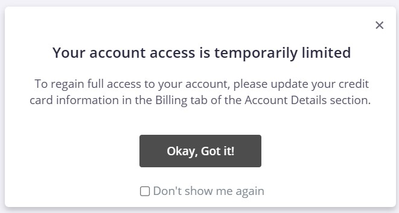

---

### 💬 Smart Tips  
Inline guidance created to reduce confusion in specific workflows.  
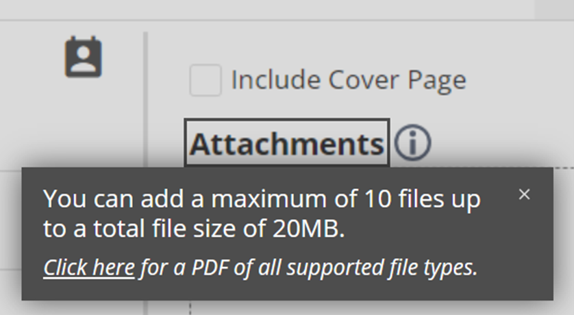  
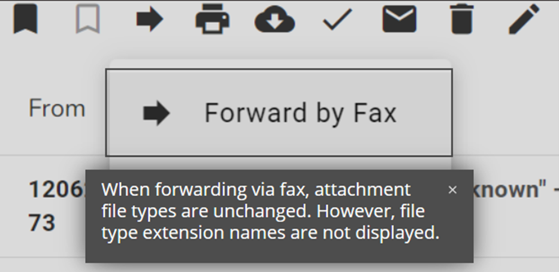

---

### 🔔 Beacons  
Used to highlight underused features or direct attention to key tasks.  
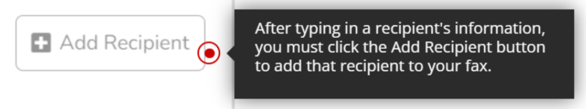  
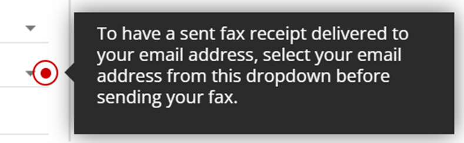

---

### 🧭 Walk-Throughs  
Multi-step guides helping users complete key tasks like sending a fax. The GIF below shows the full walk-through users can complete when composing a fax for the first time. It demonstrates the interactive flow as users follow in-app instructions.

For those who prefer to read each step, individual images of each screen in the sequence are provided below the GIF.

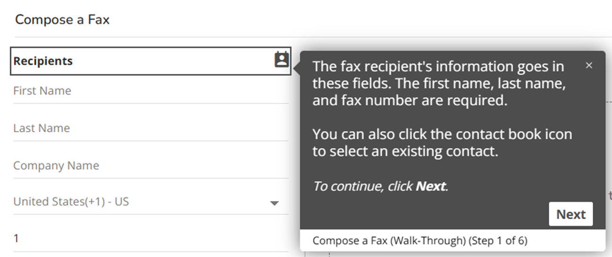  
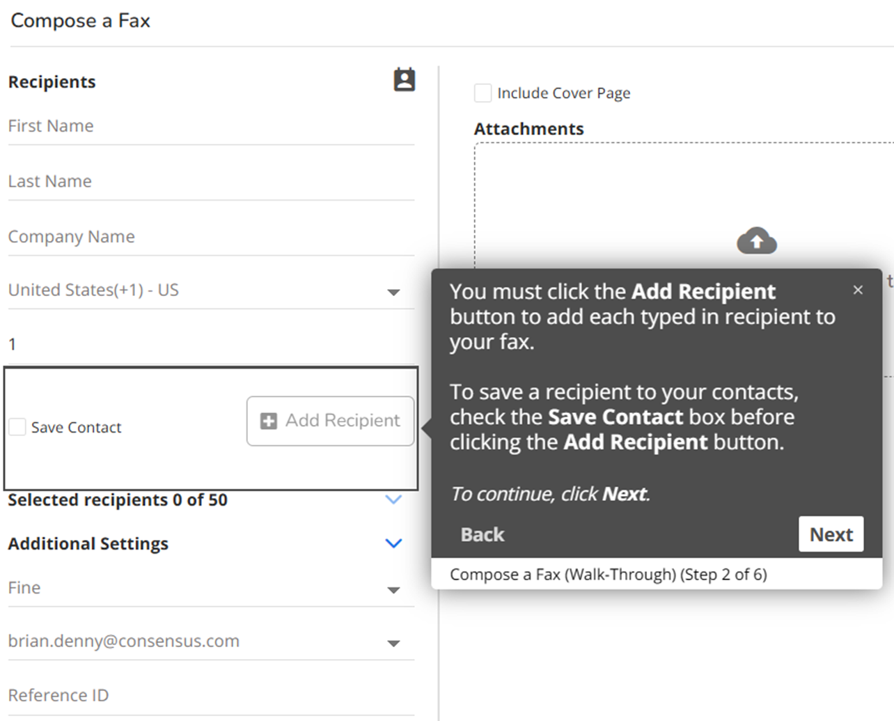  
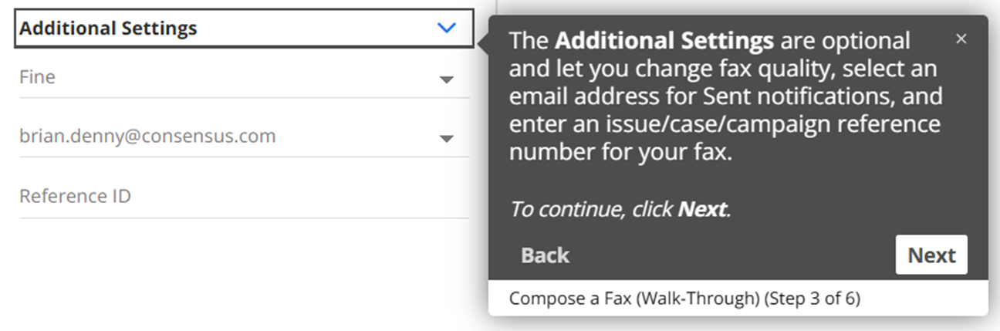  
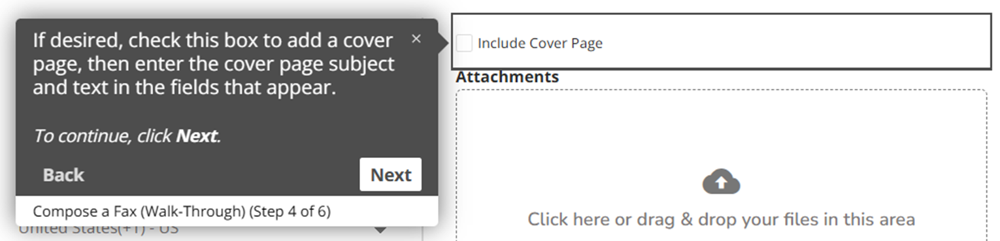  
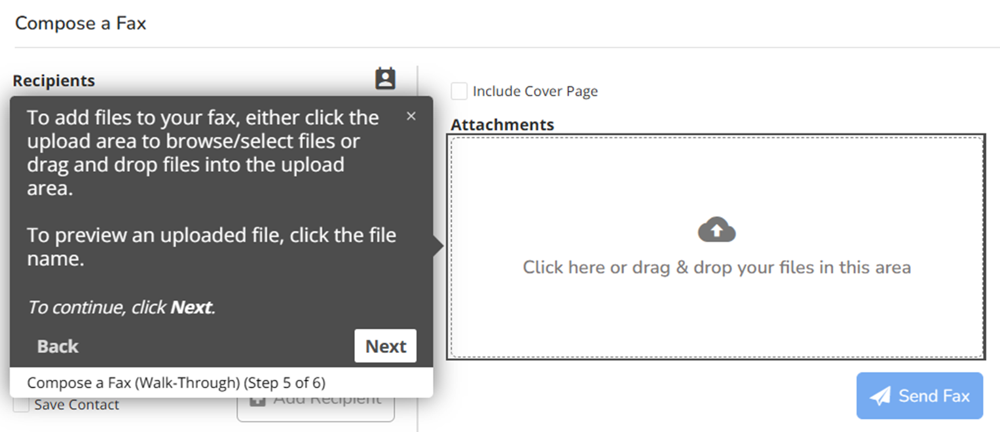  
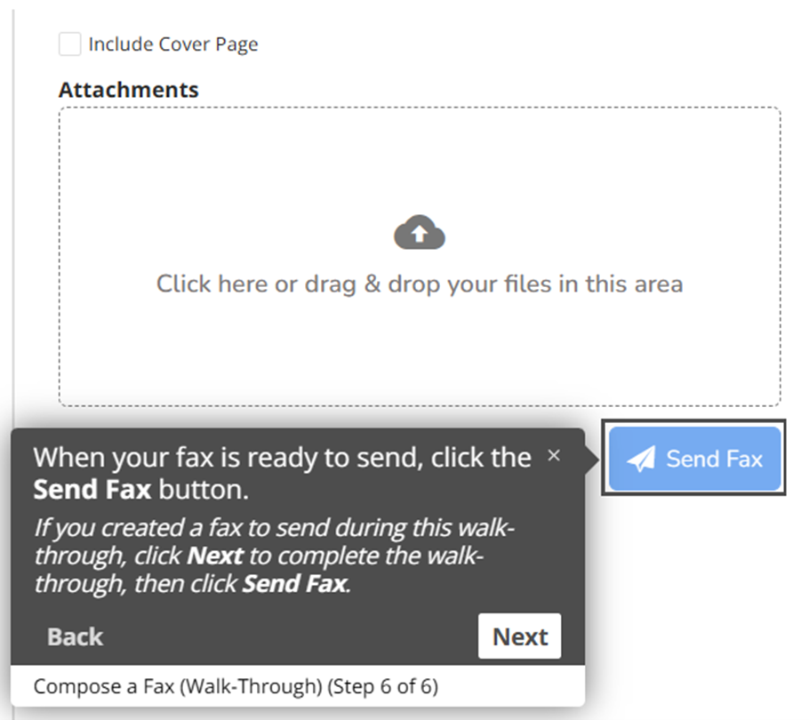

---

### 📄 Articles  
Embedded help articles triggered by page-specific display rules.  
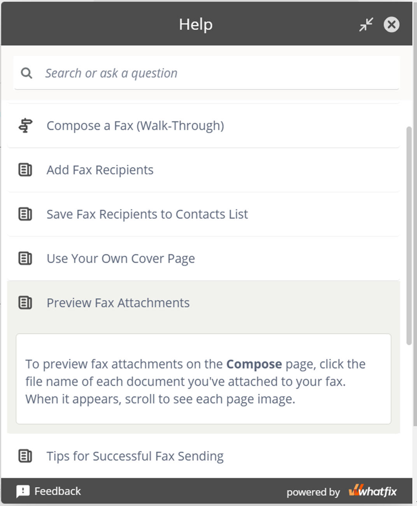  
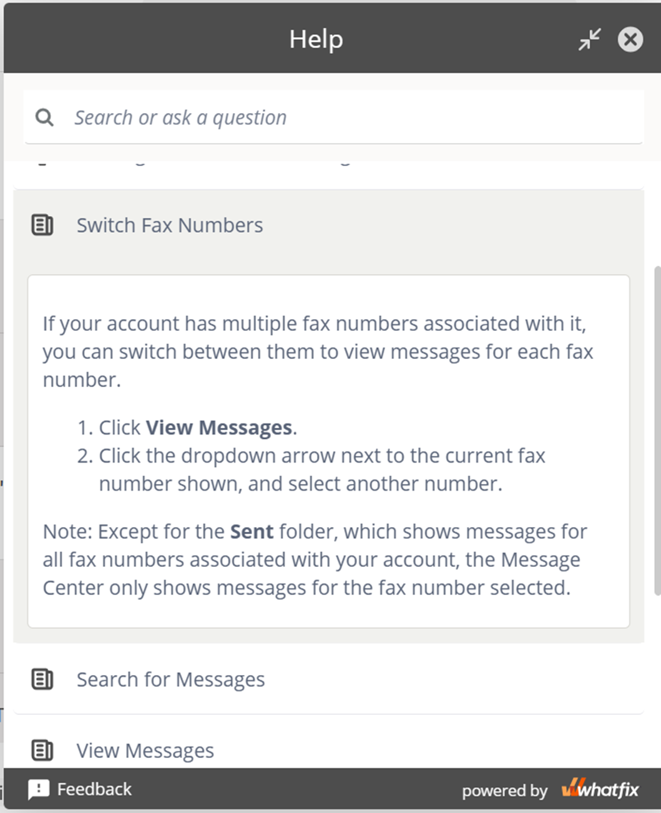  
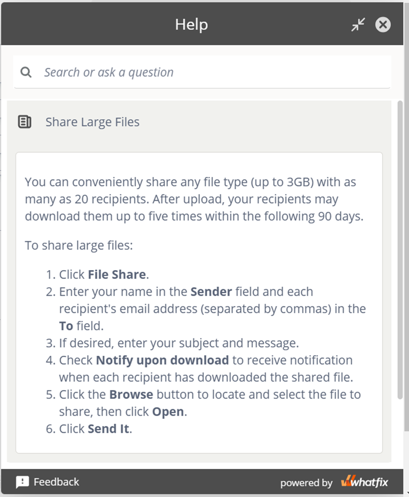  
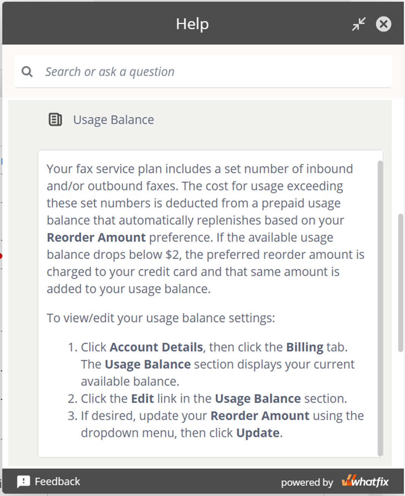

---

## 📈 Results  
- Help content has been viewed by **hundreds of thousands of users**  
- **87% of users** who completed the “Compose a Fax” walk-through rated it helpful  
- Walk-throughs accessed via popup CTAs had **higher completion rates** than those accessed through the Help widget  
- Product and Documentation teams now use engagement data to drive ongoing content improvements

This project showcases my ability to lead large-scale help content overhauls, build cross-functional systems, and deliver high-impact UX documentation informed by real user data.
