## Problem
Consensus Cloud Solutions was preparing to release a newly overhauled web application for its flagship brand, eFax, and opted to replace their traditional help documentation system with Whatfix, a third-party digital adoption software overlay. Given the extent of the redesign, all the primary help content had to be rewritten from scratch, and the transition to Whatfix content called for a writing style that was markedly different from what the Technical Documentation team was accustomed to. It also expanded our content capabilities by allowing us to create popups, tool tips, and guided walk-throughs. Additionally, Whatfix provided us access to data reporting on user activity involving both the help content and the underlying application. As the Whatfix Lead, I was responsible for ensuring the timely success of the entire set of overhauled help content, handling content requests from the Product Manager and department leadership, and gleaning insights from the newly available data.

## Solution
I first created a list of content pieces based on the program manager’s requirements and each piece’s intended location within the application. I then divided the writing tasks among my team of traditional technical writers and emphasized the basic writing guidelines (see below) introduced during the team's first joint microcontent creation process to help ensure the content was appropriate for the Whatfix format. After the initial content was written, the Technical Writing team engaged in a peer review process to ensure consistency, accuracy, and appropriateness for microcontent formats. I created the content segmentation and display rules that would ensure the popups, guided walk-throughs, and static help content would display when and as intended. I also planned and created dozens of reports and reporting spreadsheets to maximize the data at our disposal. Finally, the content (see below) was implemented in the production environment and made live for all end users. 

 

#### Basic Article Writing Guidelines
{style="color: red"}

- **Write concisely**
  - Microcontent calls for concision rather than lengthy precision.
  - Assume some UI elements/actions are self-explanatory unless we have contradictory data/feedback  
- **Aim for consistency**
  - We will read all articles as a unit before finalizing to ensure consistent terminology, style, etc.
- **Don't use tables**
  - The Help widget isn't wide enough for tables.
  - If a topic calls for a table, we may consider attaching the table as a PDF.
- **Don't use screenshots**
  - Users only access the Help widget while viewing the application. This makes screenshots unnecessary.
- **Don't use complex bullet points**
  - Bullet pointed lists should contain only one level (unlike this one, which contains two)
  - Avoid inserting a bullet pointed list anywhere in a grammatical sentence unless the final bullet completes the sentence.
- **Don't reference other articles**
  - Whatfix doesn't support clickable links to Whatfix articles or Whatfix content.
  - Information needed to contextualize or complete a process/topic should be included in that article whenever possible. 

 
 

#### Representative Content
{style="color: red"}

 

**Popups**
The first two popups below show to every user during their first two logins and offer users the opportunity to access a guided walkthrough of page functionality. One of those flows is included in its entirety in a later section on this page. The final two popups below were created specifically at the request of Product leadership. Being able to create and implement Whatfix content outside of the company's regular software development lifecycle means I regularly get requests to implement Whatfix solutions to a variety of problems that come to the attention of Product leadership.  
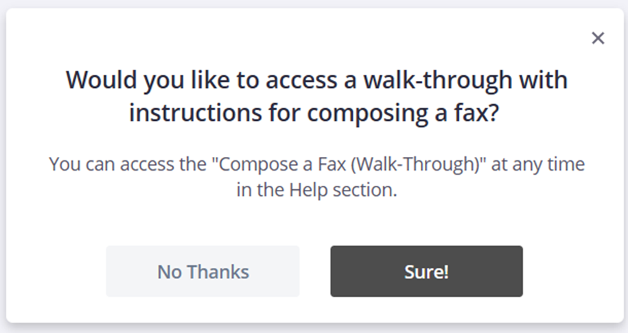
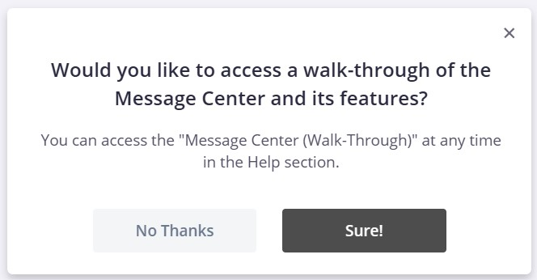
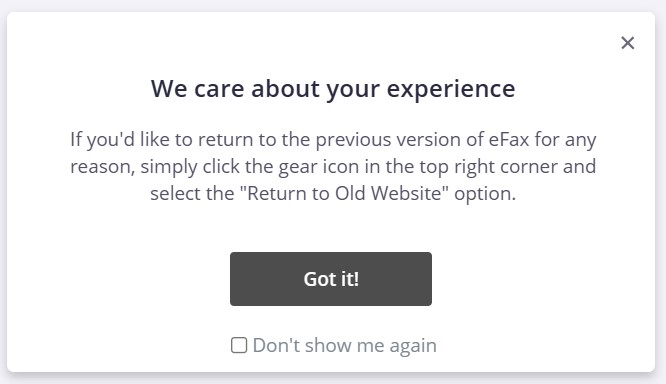
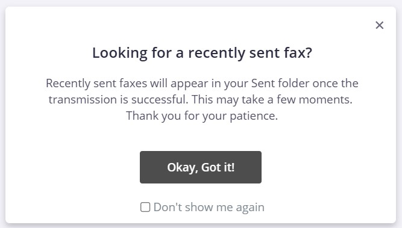
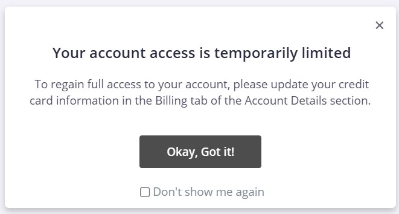

 
 

**Smart Tips** 
Each of the Smart Tips below was created at the Product Manager's request to address specific user issues or questions. 
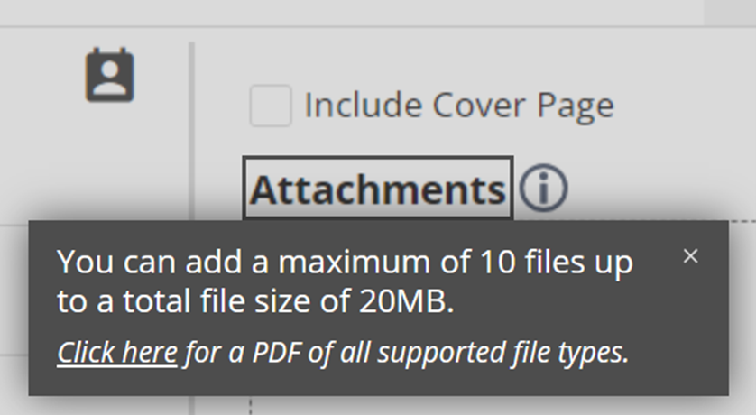
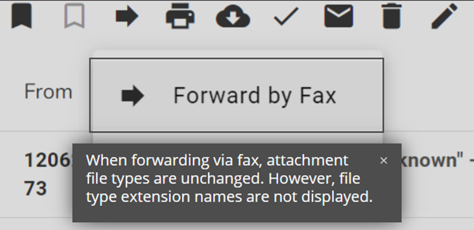

 
 

**Beacons** 
The first beacon below was created to address a substantial usability issue on the redesigned site. The Technical Documentation team is currently working on an improved selector-based solution to provide in-the-moment information specifically to users who need it. 
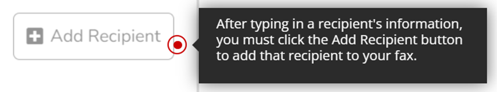
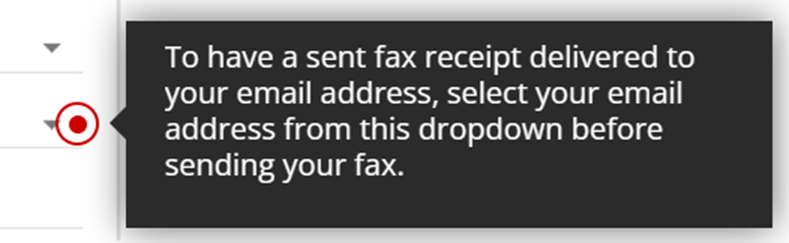

 
 

**Walk-Throughs** 
Each of the images below are part of a sequence of steps that walk users through the process of composing a fax on the redesigned application. Users can either simply read the instructions to become acquainted with the process or follow along and compose their first fax while completing the walk-through. After completing the walk-through, users are presented with a brief survey about their experience. Those results can be found in the Results section below.
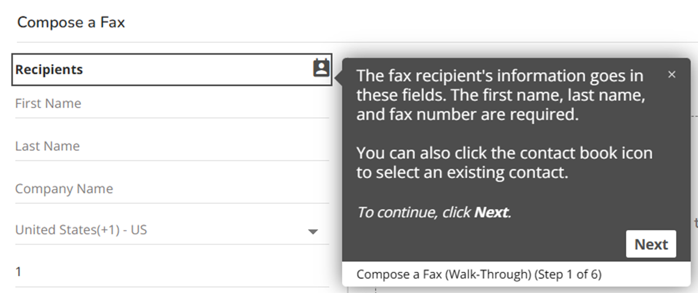
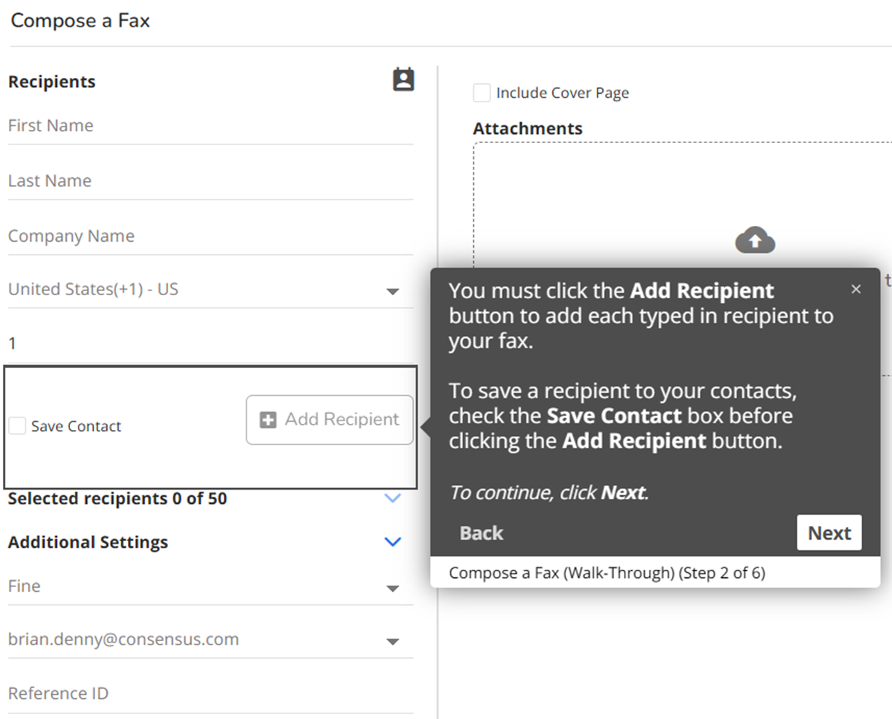
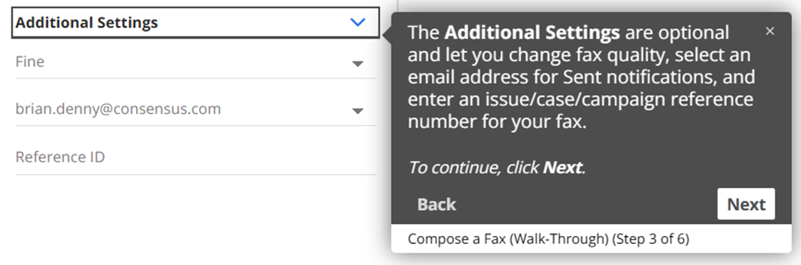
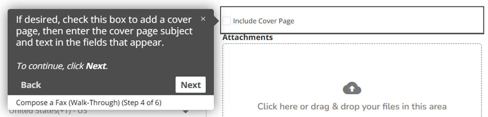
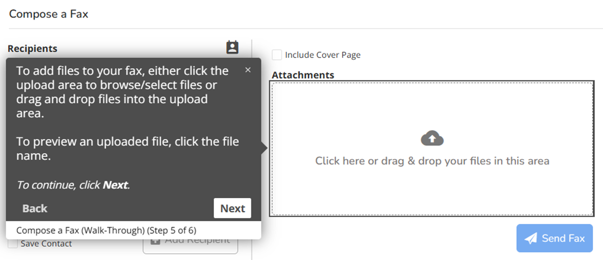
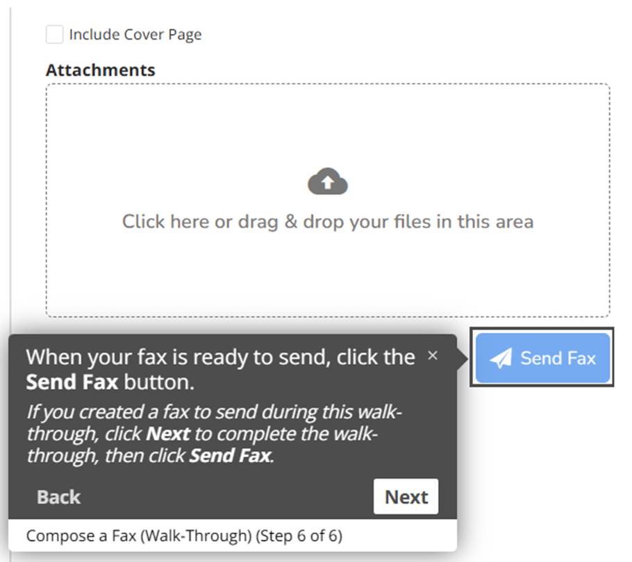

 
 

**Articles** 
There are dozens of microcontent articles available to users, and more are constantly being added. I have created display rules so that specific articles appear by default depending on the page the user is on when they open the Help widget. The Technical Documentation team regularly reports on article metrics to better understand which users are accessing the articles and when.
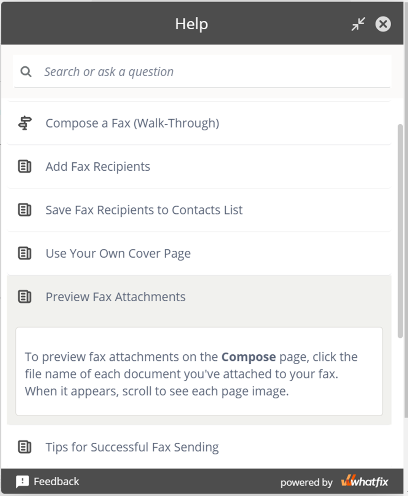
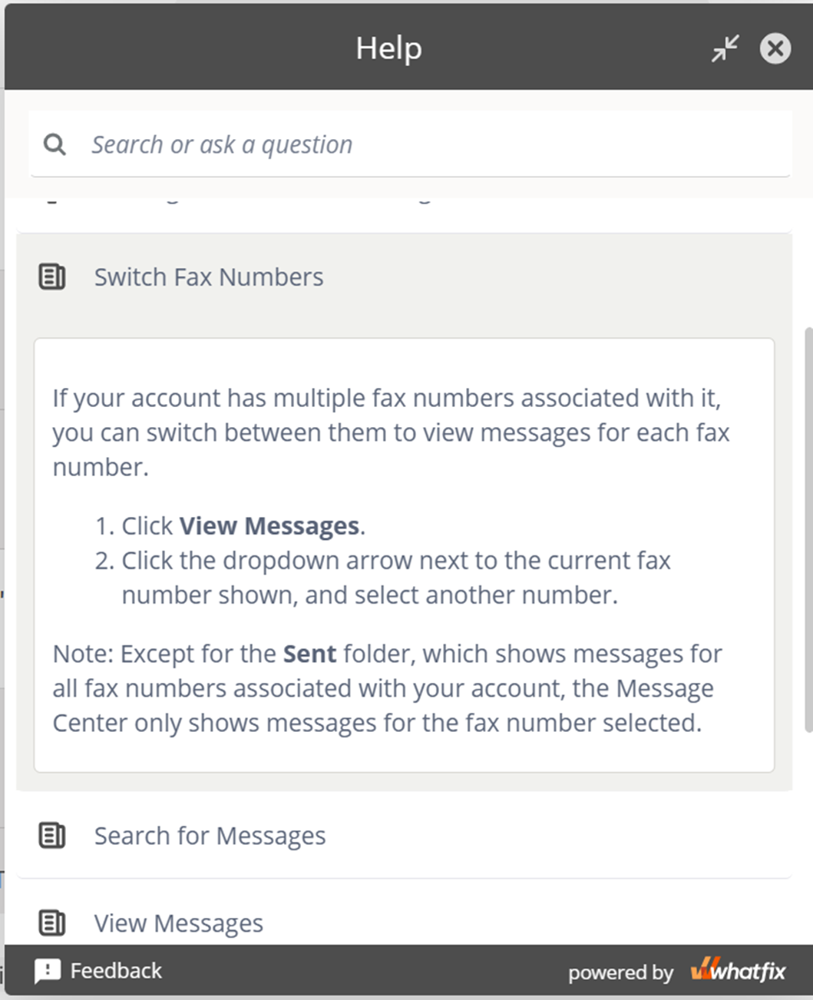
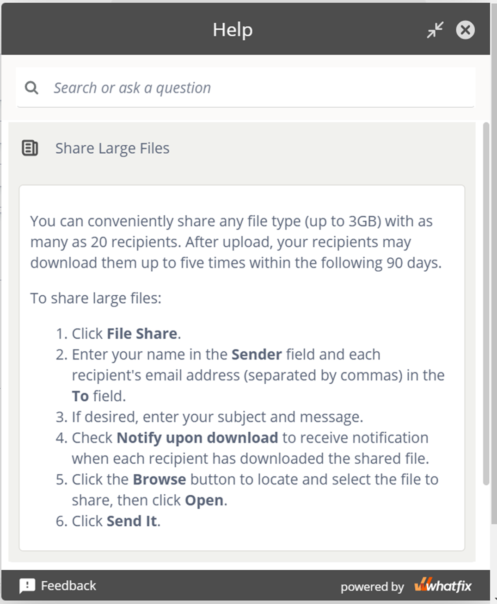
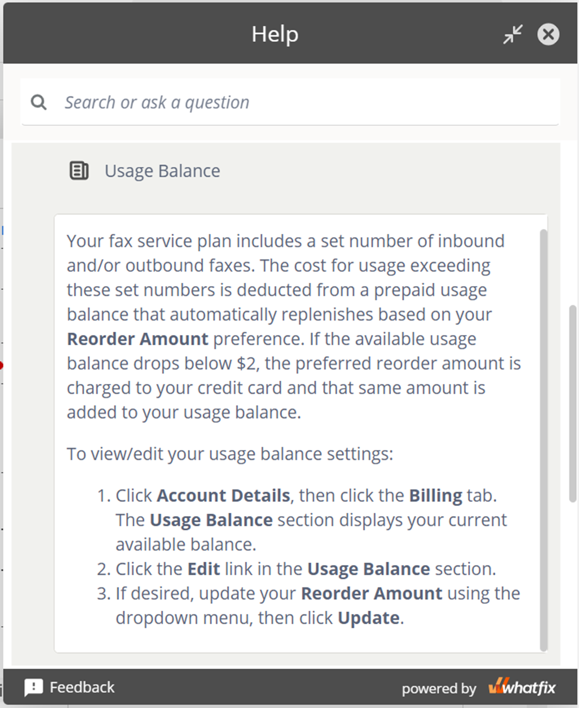

## Results 🤩
Since the release of the new application, the new content has been viewed by hundreds of thousands of users and both the Product team and the Technical Writing team have gained a variety of valuable insights. For instance, we know that users who accepted the "Compose a Fax (Walk-Through)" offer from the first popup presented on this page completed the walk-through more frequently than did users who accessed it from the Help widget. We also know that 85% of users who completed the walk-through provided feedback, and 87% of users providing feedback said they found the walk-through helpful.

<!--more-->
