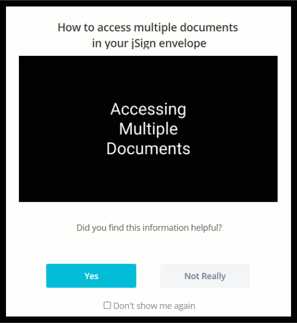

## Overview  
When a major feature update in jSign led to user confusion and increased support calls, I created a targeted, visual microcontent solution using Whatfix. The intervention improved user clarity, reduced support requests, and showcased my strength in user-centered documentation.

## 🧩 The Problem  
A newly added multi-document sending feature confused users, who couldn’t find their additional uploaded documents. On the document preparation screen, additional documents were hidden behind the expanded pages of the first document — a UI flaw difficult to fix with dev resources. Support tickets spiked.

## 💡 My Solution  
To quickly reduce confusion, I designed a **GIF-based popup** that visually guided users to their hidden documents:

- Created the GIF in **Camtasia** using clear visual cues and pacing  
- Embedded the GIF in a **targeted Whatfix popup**, shown only to users with multiple documents using **jQuery selectors**  
- Avoided long-form text in favor of quick visual learning  
- Added a simple feedback prompt to measure effectiveness  

## 📈 Results  
- **80% of users** shown the popup in early 2024 rated it “helpful”  
- Coincided with a **significant drop in related support calls**, according to the Product Manager  

This project demonstrates my ability to blend **user empathy**, **tool fluency**, and **strategic content thinking** to address real UX problems with light-lift, high-impact documentation.

