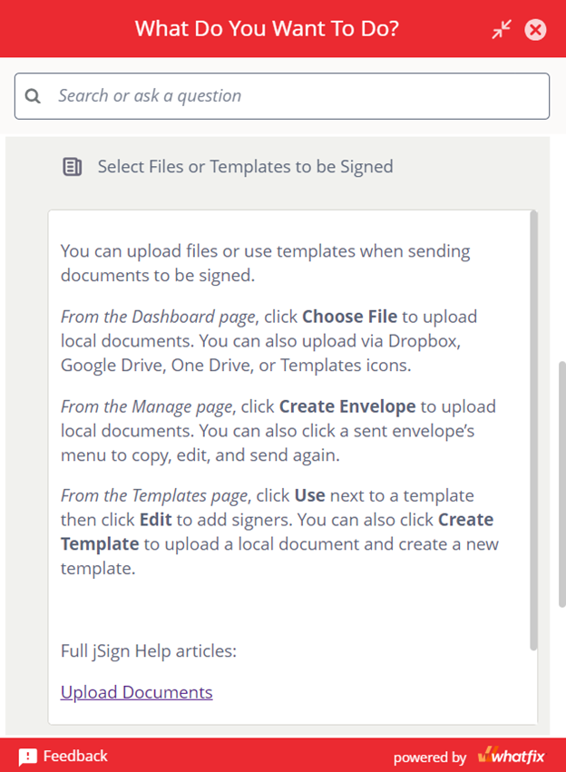
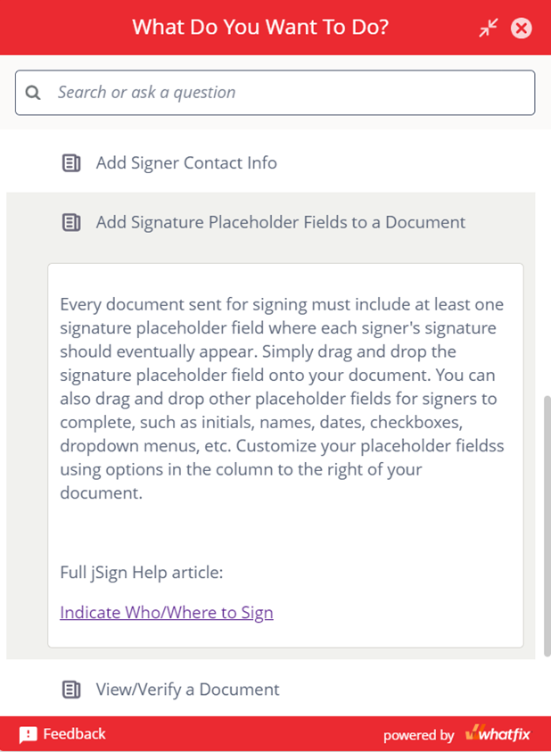
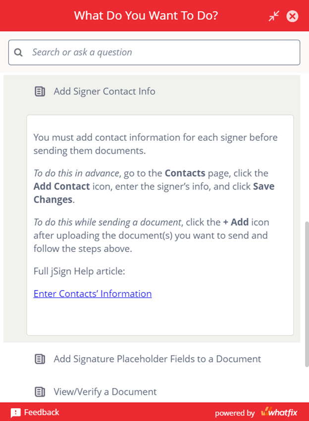

## Problem
Consensus Cloud Solutions had begun partnering with Whatfix to both transition away from single-source, topic-based authoring for external help content and prepare to implement Whatfix, a digital adoption platform, as the primary source of in-app help content on its soon-to-be redesigned web app for its flagship brand. The initial stage in this transition involved learning how to use the Whatfix platform to create help content for jSign, a document signing application with a smaller consumer base than the flagship brand. The [original help documentation](https://docs.jsign.com/help/index.htm) for jSign is nearly exhaustive and would be informative for anyone who reads it. However, its length and organizational complexity present a high bar to clear for most users and make it unusable for Whatfix content. Thus, the primary help content for Whatfix would need to be written from scratch and in a style that was markedly different from what the Technical Documentation team was accustomed to. 

## Solution
I first created a list of article topics based on jSign's most basic, and likely most common, procedures. I then divided the writing tasks among myself and my team and provided a list of **basic writing guidelines** (see below) to help ensure the content was appropriate for the new Whatfix format. After the initial writing phase, I provided feedback during a group review meeting to calibrate our writing. To ensure the final articles functioned properly in the application, I created display rules for the Whatfix content and widgets that would house the written pieces. After approving each article, I added the writing to the **formatted Whatfix content** (see below) and pushed it live to all end users. 

 

#### Basic Article Writing Guidelines
{style="color: red"}

- **Write concisely**
  - Microcontent calls for concision rather than lengthy precision.
  - Assume some UI elements/actions are self-explanatory unless we have contradictory data/feedback  
- **Aim for consistency**
  - We will read all articles as a unit before finalizing to ensure consistent terminology, style, etc.
- **Don't use tables**
  - The Help widget isn't wide enough for tables.
  - If a topic calls for a table, we may consider attaching the table as a PDF.
- **Don't use screenshots**
  - Users only access the Help widget while viewing the application. This makes screenshots unnecessary.
- **Don't use complex bullet points**
  - Bullet pointed lists should contain only one level (unlike this one, which contains two)
  - Avoid inserting a bullet pointed list anywhere in a grammatical sentence unless the final bullet completes the sentence.
- **Don't reference other articles**
  - Whatfix doesn't support clickable links to Whatfix articles or Whatfix content.
  - Information needed to contextualize or complete a process/topic should be included in that article whenever possible. 

{}
While Whatfix doesn't support linking to Whatfix articles, it does support linking to external URLs. The revised articles below include links to the relevant original help articles. This provided an easy way for users to locate the exhaustive instructions as we transitioned away from the traditional format.{}

 
 

#### Representative Content
{style="color: red"}

 

**Microcontent Article** pared down from its [original version](https://docs.jsign.com/help/webapp/thedashboardpg/uplddcmts.htm) 

 
 

**Microcontent Article** pared down from its [original version](https://docs.jsign.com/help/webapp/themanagepg/indctwhowhr2sgn.htm)

 
 

**Microcontent Article** pared down from its [original version](https://docs.jsign.com/help/webapp/thecontactspg/entrcntctsinfo.htm)

## Results 🤩
Prior to partnering with Whatfix, the Technical Documentation team at Consensus had not engaged in much joint content creation and had instead divided product writing tasks between individual team members, an approach that mirrored the broader departmental insulation at play across the company. This project represents my initial effort at transitioning the team away from these silos and toward a more collaborate approach that encourages shared awareness of and interest our microcontent program.
<!--more-->
