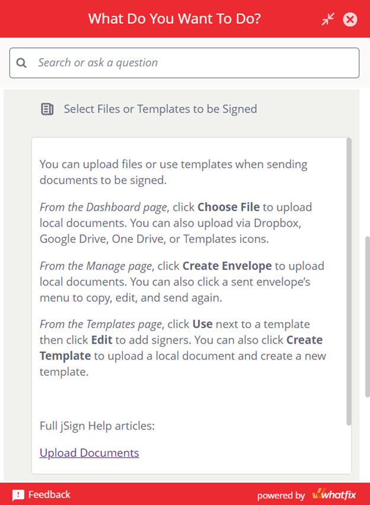
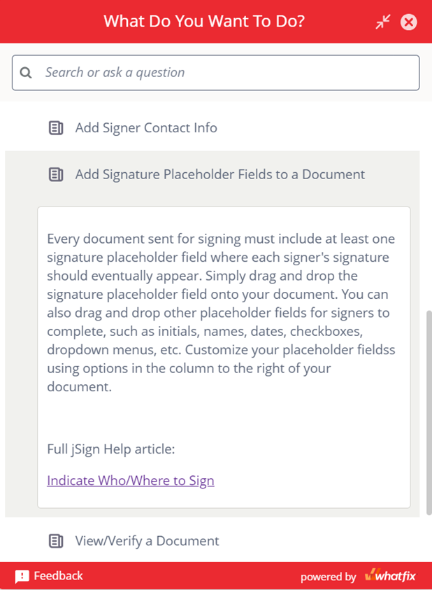
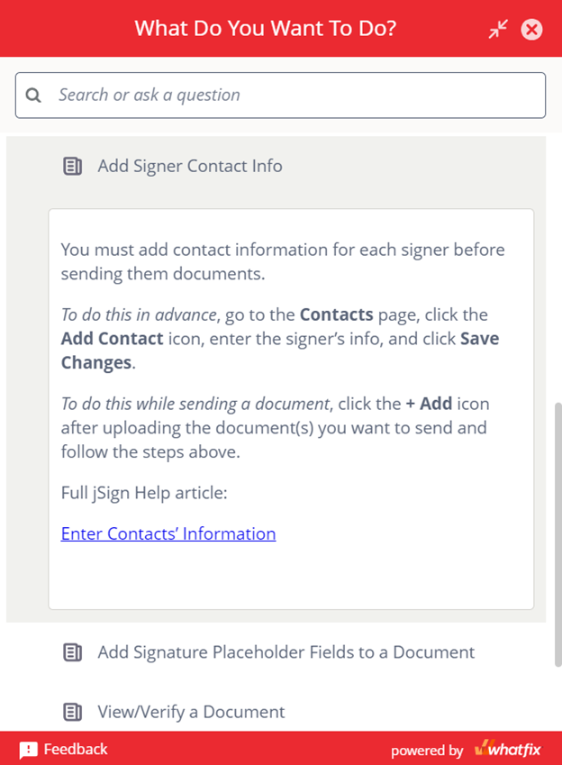

## Overview  
To support a major shift toward embedded help content in Consensus Cloud Solutions' applications, I led the Technical Writing team’s first coordinated effort to produce microcontent. The result was user-friendly documentation deployed in-app via Whatfix — and a meaningful cultural shift toward more collaborative content creation.

## 🧩 The Problem  
As part of a company-wide redesign and documentation overhaul, we needed to move away from lengthy user manuals like [this original jSign documentation](https://docs.jsign.com/help/index.htm). The new goal was to create concise, embedded help content within the jSign interface using **Whatfix**, a digital adoption platform.  

The original docs were nearly exhaustive but not usable in Whatfix due to:
- Length and complexity
- Agnostic to account type and user role
- An entirely different writing style and structure

## 💡 My Solution  
I organized and led our first teamwide microcontent authoring initiative:

- Identified **core user tasks** in jSign and created an article topic list
- Created and distributed **microcontent writing guidelines** to ensure consistency and fit for Whatfix
- Led **peer review sessions** to align style and structure across the team
- Created Whatfix **display rules and widgets** to house and trigger content contextually in-app
- Finalized and deployed each article using Whatfix’s authoring tools and targeting logic

### ✍️ High-Level Microcontent Guidelines Highlights

- Keep writing concise (assume UI elements are partially self-explanatory)  
- Avoid screenshots, tables, or nested bullet points (widget space constraints)  
- Include link to original articles (offer fallback for users who want it)  

{}  
The writing guidelines created for this project became the foundation for future microcontet Whatfix efforts across other apps in the organization.  
{}

### 📌 Representative Content  
**Before/After Examples of Microcontent Conversions**

**1. Uploading Documents**  
From: [original article](https://docs.jsign.com/help/webapp/thedashboardpg/uplddcmts.htm)  

**2. Indicating Who Should Sign**  
From: [original article](https://docs.jsign.com/help/webapp/themanagepg/indctwhowhr2sgn.htm)  

**3. Adding Contact Info**  
From: [original article](https://docs.jsign.com/help/webapp/thecontactspg/entrcntctsinfo.htm)  

## 📈 Results  
- First project to apply **Whatfix microcontent strategy at scale**  
- Set the standard for **style, structure, and deployment** for future in-app help  
- Encouraged a shift away from siloed work — and toward **collaborative content creation**

This project highlights my ability to lead documentation strategy, train a team on new tools and formats, and deliver user-focused content that aligns with evolving product needs.

